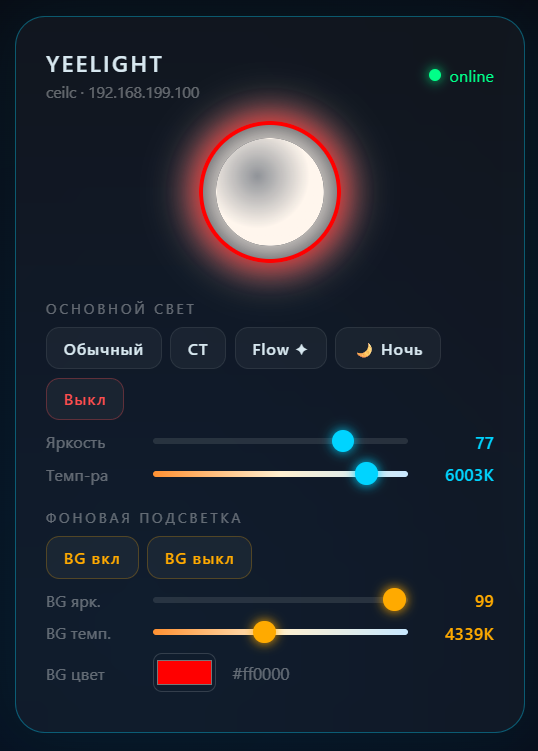

# ioBroker.yeelight-lan-direct

**Прямое управление лампами Yeelight и Mi по локальной сети — без облака, без посредников, без компромиссов.**

[English version → README.md](README.md)

Ваши лампы — в вашей сети. Команды к ним должны идти так же. Адаптер общается с устройствами напрямую по TCP/JSON-RPC — тем же протоколом, что официальное приложение в локальном режиме, — с откликом в миллисекунды и нулевой зависимостью от чьих-либо серверов.

<p align="center"></p>

## Чем этот адаптер отличается

Способов управлять Yeelight из ioBroker несколько. Вот что здесь сделано иначе:

- **Объекты по реальным возможностям лампы.** При SSDP-обнаружении адаптер читает, что лампа *действительно умеет*, и создаёт только нужные состояния. Моно-лампочка не получит мёртвых `hue`/`sat`; люстра с амбилайтом получит полный набор фоновой подсветки (`bg_power`, `bg_ct`, `bg_rgb`, `bg_hue`…). Никакого мусора в дереве объектов.
- **Встроенный пульт.** Живая панель управления прямо в Admin: лампа на экране светится своим *настоящим* текущим цветом и яркостью, слайдеры и кнопки — только те, что поддерживает модель, у ламп с подсветкой — отдельное живое кольцо амбилайта. Это не страница настроек — это пульт.
- **Полная поддержка фоновой подсветки.** Питание, яркость, температура, RGB и HSV фонового канала — то, что многие аналоги просто пропускают.
- **Протокол — как положено.** Команды идут через троттлящую очередь (прошивка Yeelight молча теряет пачки команд), булевы значения и режимы нормализуются, flow-выражения (`start_cf`) парсятся в обе стороны. Написано по официальной спецификации Yeelight Inter-Operation Spec, а не по догадкам.
- **Инкрементальные состояния.** `BRIGHT_UP/DOWN`, `CT_UP/DOWN`, `HUE_CW/CCW` и компания — вешаются на выключатели и крутилки напрямую, без скриптов.
- **Живучее обнаружение.** SSDP на UDP 1982 с режимами «все интерфейсы» и ручным адресом — работает даже на хостах с VPN и несколькими сетевыми картами, где наивный поиск не находит ничего.
- **Чистая архитектура.** Протокольное ядро (`core/`) — чистый Node.js без ioBroker-зависимостей: тестируется автономно, отлаживается в браузере, переиспользуется CLI-утилитами (`cli/scan`, `cli/control`).

Код сопровождается с инженерным упрямством в вопросах корректности: разделение слоёв — жёсткое правило, у каждой команды один чётко определённый маршрут, а найденные причуды протокола документируются, а не просто обходятся.

## Требования

- Лампы с включённым **LAN Control** в приложении Yeelight
- js-controller ≥ 5.0.0, Admin ≥ 7 (JSON-Config)
- Node.js ≥ 18

## Установка

Пока адаптер не в официальном репозитории — установка с GitHub: Admin → Адаптеры → иконка GitHub → **Custom**:

```
https://github.com/KOE73/iobroker.yeelight-lan-direct
```

или из командной строки:

```bash
iobroker url https://github.com/KOE73/iobroker.yeelight-lan-direct.git
iobroker add yeelight-lan-direct
```

> Важно: установка с GitHub только ставит пакет — инстанс она не создаёт (так работает `iobroker url` для любого адаптера). Либо выполните `iobroker add`, как выше, либо после установки нажмите **«+»** на карточке адаптера в Admin — тогда и окно настроек откроется автоматически.

## Быстрый старт

1. Создайте инстанс, откройте настройки.
2. Нажмите **Discover** — найденные лампы добавятся в таблицу вместе со своими возможностями.
3. Сохраните. Состояния появятся в `yeelight-lan-direct.0.<deviceId>.*`.
4. Откройте вкладку **Пульт Yeelight** в левом меню Admin — и управляйте.

Если лампы не находятся — переключите режим обнаружения на **Все интерфейсы** (типично для хостов с VPN/несколькими сетевыми) и проверьте, что LAN Control включён.

## Основные состояния

| Состояние | Описание |
|---|---|
| `power`, `bright` | питание и яркость основного света |
| `ct` | цветовая температура 2700–6500 K |
| `hue`, `sat` | цвет HSV (если поддерживается) |
| `ON_NORMAL`, `ON_CT`, `ON_RGB`, `ON_HSV`, `ON_FLOW`, `ON_NIGHT`, `OFF` | кнопки режимов |
| `BRIGHT_UP/DOWN`, `CT_UP/DOWN`, `HUE_CW/CCW`, `SAT_UP/DOWN` | инкрементальные шаги |
| `bg_power`, `bg_bright`, `bg_ct`, `bg_rgb`, `bg_hue`, `bg_sat` | фоновая подсветка / амбилайт |
| `flow_params`, `scene`, `delayoff` | эффекты, сцены, таймер сна |
| `_connected`, `info.connection` | связь с лампой и сводный индикатор |

## История изменений

### 0.3.1 (2026-07-04)
- Встроенная вкладка-**пульт** в Admin: живое свечение реальным цветом и яркостью, элементы управления по возможностям лампы, кольцо фоновой подсветки

### 0.3.0
- Стандартная интеграция ioBroker: админка на JSON-Config, маршрутизация команд через `onStateChange`, стабильные id объектов, `info.connection`, ядро без глобальных шимов

### 0.2.0
- Пульт по возможностям лампы, сохранение caps, исправлены очередь команд и подписки на состояния

### 0.1.x
- Первые выпуски: обнаружение, прямое TCP-управление, исправления логирования

## Лицензия

MIT © [KOE73](https://github.com/KOE73)
